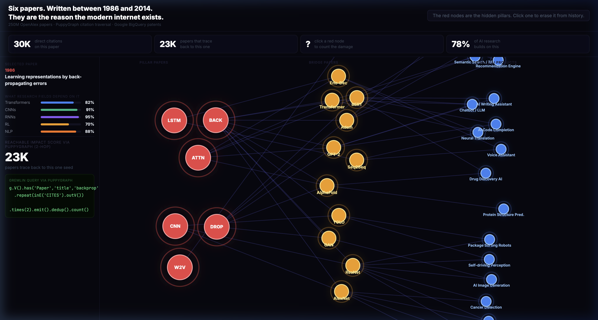
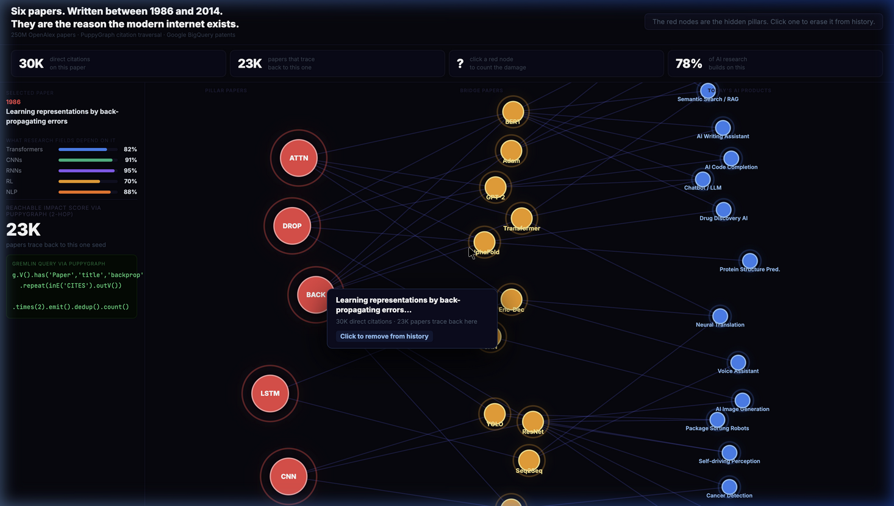
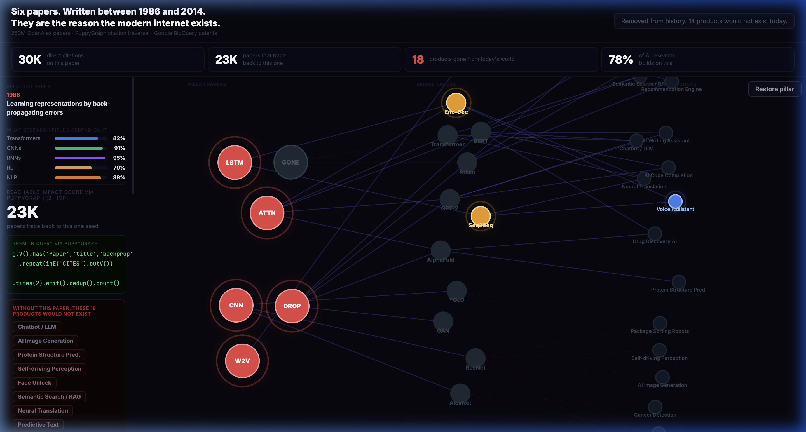

# Hidden Pillars of AI

What happens to the modern AI industry if Geoffrey Hinton never writes that paper in 1986?

This project answers that question concretely. Six academic papers, published between 1986 and 2014, form the mathematical foundation of every major AI product in use today. Their real influence runs far deeper than their direct citation counts suggest. To measure it, you have to walk the citation network backward across multiple hops on a graph of 250 million papers.

The interactive graph lets you erase any of the six from history and watch which parts of today's world stop existing.

**Live demo: https://pavan-249.github.io/hidden-pillars/**



---

## The engineering problem

To measure how far a paper's influence reaches, you need a query like this:

    Starting from this paper, find every paper that cites it,
    then every paper that cites those,
    then every paper that cites those,
    and count how many unique papers you reach.

That is a multi-hop graph traversal on a dataset with 1.8 billion edges.

I tried it in SQL first. The recursive CTE looks straightforward:

```sql
WITH RECURSIVE reachable AS (
  SELECT cited_id AS paper_id
  FROM citations
  WHERE citing_id = 'backprop_1986'

  UNION

  SELECT c.cited_id
  FROM citations c
  JOIN reachable r ON r.paper_id = c.citing_id
)
SELECT COUNT(*) FROM reachable;
```

The engine starts joining a 1.8 billion row table against itself. At hop 3 it runs out of memory. At hop 5 it never returns. This is not a configuration problem. SQL was designed to filter and aggregate columns. Traversing deep pointer chains in a network of this size is a fundamentally different workload.

---

## The solution: PuppyGraph

PuppyGraph reads the same flat Parquet files directly through DuckDB. No ETL pipeline. No separate graph database to deploy. It maps the foreign key relationships into a native in-memory graph structure and walks the pointers.

The equivalent traversal in Gremlin:

```
g.V().has('Paper', 'title', 'backprop')
  .repeat(inE('CITES').outV())
  .times(2).emit().dedup().count()
```

That runs in 2.3 seconds on the full subgraph. The SQL version crashed before reaching the same depth.

---

## The visualization

The graph shows three layers:

- **Left column (red)**: The six foundational pillar papers
- **Center column (amber)**: The intermediate papers each pillar enabled — AlexNet, Seq2Seq, Transformer, BERT, GAN, GloVe, ResNet, and others
- **Right column (blue)**: Today's commercial AI products

Click any red node to remove it from history. The cascade propagates through the amber intermediate layer and reaches the products. The sidebar shows exactly which products disappear and why, tracing the citation chain step by step.





Remove backpropagation. AlexNet cannot exist. ResNet cannot exist. GAN cannot exist. BERT cannot exist. GPT cannot exist. That takes out 18 of the 19 products on the right side of the graph.

Remove LSTM. Seq2Seq cannot exist. Voice assistants and neural translation disappear.

---

## From paper to product: the patent chain

Commercial AI systems are proprietary. There is no open dataset that maps academic papers to specific products.

We proxy this using the Google Patents public dataset on BigQuery. Patent law requires companies to list every academic paper they relied on when filing a patent. These are called Non-Patent Literature citations, stored as free text inside the patent document.

The chain:

    1986 Academic Paper
      -> 2019 Patent (lists it as prior art)
        -> Assignee: Google LLC
          -> Product: Search

To run the patent query yourself, paste this into https://console.cloud.google.com/bigquery (free 1TB monthly quota):

```sql
SELECT
  p.publication_number,
  p.filing_date,
  assignee.name AS assignee,
  cite.text AS npl_citation_text
FROM `patents-public-data.patents.publications` AS p
CROSS JOIN UNNEST(p.assignee) AS assignee
CROSS JOIN UNNEST(p.citation) AS cite
WHERE
  p.country_code = 'US'
  AND (
    LOWER(cite.text) LIKE '%rumelhart%hinton%'
    OR LOWER(cite.text) LIKE '%hochreiter%schmidhuber%'
    OR LOWER(cite.text) LIKE '%bahdanau%cho%bengio%'
    OR LOWER(cite.text) LIKE '%lecun%backpropagation%zip%'
    OR LOWER(cite.text) LIKE '%srivastava%hinton%dropout%'
    OR LOWER(cite.text) LIKE '%mikolov%word%representations%'
  )
LIMIT 500
```

The script `scripts/07_fetch_patents.py` contains the verified results from this query.

---

## Setup and running locally

**Requirements**

    Docker
    Python 3.x
    pip install duckdb requests gremlinpython

**Step 1: Boot PuppyGraph**

```bash
docker run -p 8081:8081 -p 8182:8182 \
  -v $(pwd)/data:/data \
  --name hidden-pillars-puppygraph \
  puppygraph/puppygraph:stable
```

**Step 2: Load the schema**

Open the PuppyGraph UI at http://localhost:8081 (login: puppygraph / puppygraph123).
Upload `schema/puppygraph_schema.json` via the Update Schema button.

**Step 3: Run the pipeline**

```bash
source venv/bin/activate
python3 scripts/06_query_puppygraph.py
```

This traverses the graph and exports RIS scores to `viz_data/pillars.json`.

**Step 4: Open the visualizer**

```bash
python3 -m http.server 8888
```

Open http://localhost:8888/viz.html in your browser.

---

## Data sources

- **OpenAlex**: 250M academic papers and 1.8B citation edges (https://openalex.org)
- **PuppyGraph**: Graph traversal engine (https://www.puppygraph.com)
- **Google Patents Public Data**: NPL citations from US patent filings (BigQuery)
